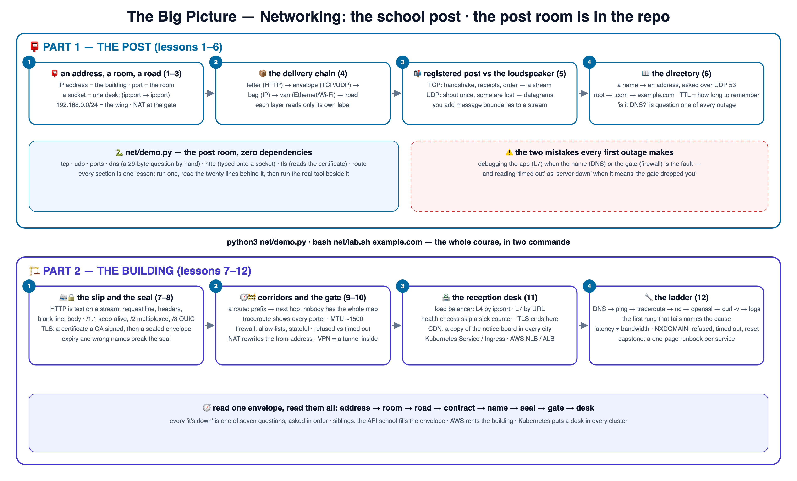

# 🕸️ Learn Networking School — the school post

**12 branch-by-branch lessons** that teach networking the way a school post
room works: an address, a room number, a road, and a receipt. Every lesson is
an explain-like-I'm-5 story with a numbered diagram — and the post room is
**in the repo**: a zero-dependency Python lab that opens real sockets,
hand-writes a DNS question and an HTTP request, and reads a TLS certificate.

🌐 **Interactive site:** **<https://baluraut.github.io/learn-networking-school/>** —
lesson cards, every lesson as a numbered diagram, the big-picture 4K, a quiz,
a study plan and the before-and-trade-offs page. Marathi + English by default.

```bash
git clone https://github.com/BaluRaut/learn-networking-school.git && cd learn-networking-school
python3 net/demo.py                # TCP, UDP, ports, a DNS question by hand, HTTP by hand, a TLS certificate, your route
bash net/lab.sh example.com        # the debugging ladder: dig → ping → traceroute → nc → openssl → curl
```

## 🗺️ The big picture



## 🎓 The 12 lessons

Each numbered branch adds ONE lesson folder (`lessons/NN-topic/README.md`) with an
explain-like-I'm-5 story, a school analogy, a diagram, **What / Why / How**, a
hands-on lab on the real code, and Verify / Common-mistakes sections. Branches are
**sequential** — branch 07 contains lessons 01–07.

```bash
git checkout lesson-01-why-networking     # read lessons/01-why-networking/README.md, then...
git checkout lesson-02-ip-addresses       # ...keep going, one branch at a time
```

### Part 1 — the post 📮

| # | Branch | You learn | Analogy |
|---|---|---|---|
| 01 | `lesson-01-why-networking` | An address, a room, a road, a receipt — the whole subject in one envelope | The school post 📮 |
| 02 | `lesson-02-ip-addresses` | IPv4/IPv6, CIDR, private ranges, NAT, loopback, the gateway | The building's address 🏫 |
| 03 | `lesson-03-ports-sockets` | Ports, sockets, the 4-tuple, listening vs connected, `ss`/`lsof` | Room numbers and desks 🚪 |
| 04 | `lesson-04-layers` | Encapsulation, the 5 layers that matter, L4 vs L7, MTU | The delivery chain 📦 |
| 05 | `lesson-05-tcp-udp` | The handshake, streams vs datagrams, loss, message boundaries | Registered post vs the loudspeaker 📬 |
| 06 | `lesson-06-dns` | Resolvers, records, TTL, a query built by hand, `dig` | The directory 📖 |

### Part 2 — the building 🏗️

| # | Branch | You learn | Analogy |
|---|---|---|---|
| 07 | `lesson-07-http-on-the-wire` | Request/response as bytes, keep-alive, HTTP/2 and /3 | The slip in the envelope 📨 |
| 08 | `lesson-08-tls` | Certificates, CAs, the handshake, SNI, what TLS proves | The sealed envelope 🔒 |
| 09 | `lesson-09-routing` | Routes, gateways, TTL and traceroute, MTU, BGP | The corridor map 🧭 |
| 10 | `lesson-10-firewalls-nat-vpn` | Stateful rules, security groups, NAT, refused vs timed out, tunnels | The gate 🚧 |
| 11 | `lesson-11-load-balancers-cdn` | L4/L7, health checks, sticky sessions, proxies, CDNs | The reception desk 🏪 |
| 12 | `lesson-12-debugging` | The seven-rung ladder, latency vs bandwidth, the toolbox | The triage ladder 🔧 |

## 📦 What's in this repo (main branch)

```
learn-networking-school/
├── net/
│   ├── demo.py               # the post room: tcp · udp · ports · dns · http · tls · route — stdlib only
│   ├── lab.sh                # the debugging ladder as one script
│   └── expected-output.txt   # what a healthy run prints
└── docs/                     # the GitHub Pages site
```

## 📜 License

MIT — see [LICENSE](LICENSE). Found a mistake? [Open an issue](https://github.com/BaluRaut/learn-networking-school/issues).
