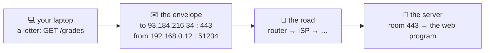

# 📮 Lesson 01 — Why networking: the school post

**📍 You are here:** Lesson **01** of 12 · Next: `lesson-02-ip-addresses`

---

## 📦 What's in this branch

The problem networking solves — and the one picture (a **letter with an
address, a room number and a road**) that explains every lesson after this.
Real files you will use all the way through:

- [net/demo.py](../../net/demo.py) — the post room: real sockets, a hand-written DNS question, an HTTP request typed by hand, a TLS certificate — zero dependencies
- [net/lab.sh](../../net/lab.sh) — the debugging ladder as one script (lesson 12)
- [net/expected-output.txt](../../net/expected-output.txt) — what a healthy run prints

> 🎒 **Before you start:** you need **Python 3** and a terminal. The online
> sections (DNS, HTTP, TLS) need the internet and skip politely without it.
> Good neighbours: the [API school](https://baluraut.github.io/learn-api-school/)
> (what travels inside the envelope) and the
> [AWS school](https://baluraut.github.io/learn-aws-school/) (this building,
> rented by the hour).

## 🧒 Explain like I'm 5

Two children in different buildings want to pass notes. A note alone goes
nowhere. It needs an **envelope** with the other building's **address**, the
**room number** of the child, and a **road** between the buildings. And the
sender would like a **receipt** — or, for a shout across the playground, no
receipt at all.

That is the whole of networking. The address is an **IP address**. The room is
a **port**. The road is the **layers** below you (Wi-Fi, cables, routers). The
receipt is **TCP**; the shout is **UDP**. The school **directory** that turns
"the science lab" into a room number is **DNS**. The sealed envelope nobody on
the corridor can read is **TLS**. The gate that checks who may enter is the
**firewall**. Twelve lessons, one post room.

## 🗺️ Diagram



## ❓ What

- A **network** is any road along which envelopes travel: your Wi-Fi, the
  office LAN, the internet.
- An **IP address** names a building; a **port** names a room; together
  (address:port on both ends) they name one conversation — a **socket**.
- **Protocols** are the agreed shapes of the letters and envelopes: IP, TCP,
  UDP, DNS, HTTP, TLS. Each lives at a **layer** and trusts the one below.
- **Latency** is how long one letter takes; **bandwidth** is how many letters
  per second. They are different problems (lesson 12).

## 🤔 Why

Every "the site is down", "it works on my machine", "the database is slow from
the other region" is a post-room question. Engineers who can read an envelope
find the fault in minutes; those who cannot restart things until it goes away.

## 🔧 How (in this repo)

`net/demo.py` is one file with seven sections, each a few lines of the
standard library's `socket` and `ssl`: a TCP server and client in threads, a
lossy UDP sender, a port knocker, a DNS query built byte by byte, an HTTP
request written straight onto a socket, a TLS handshake that prints the
certificate, and a route check. Every later lesson points at its section.

## 🧪 Try it

```bash
python3 net/demo.py tcp ports        # two offline sections: a handshake and receipts, then a knock on the usual rooms
python3 net/demo.py                  # all seven (the online ones need the internet)
ip addr 2>/dev/null || ifconfig      # your building's address(es) — find the 192.168.x.x or 10.x.x.x one
```

## ✅ Verify — what you should see

The `tcp` section prints your socket and the clerk's socket as two
`ip:port` pairs, then `receipt: 31 bytes`. The `ports` section prints one line
per well-known room, most of them `closed` on a laptop. Compare with
[net/expected-output.txt](../../net/expected-output.txt) — the port numbers
differ, the shape does not.

## 🏁 What you just proved

A conversation on a network is two `address:port` pairs and a road between
them — and you can open one from Python in three lines.

## ⚠️ Common mistakes

- Thinking an IP address names a program. It names a machine; the port names the program.
- Confusing "no internet" with "DNS is broken" — usually the second (lesson 06).
- Believing the network is a black box. It is envelopes; every tool in lesson 12 opens one.

> 🏭 **Why this matters in production:** every outage ticket is one of six
> questions — name, reach, route, room, seal, or letter — and lesson 12's
> ladder asks them in order. Learning the post room is learning to triage.

## ⏭️ Next

**Lesson 02 — IP addresses & subnets:** what 192.168.0.12/24 really says, and
why two homes on earth can share it.
