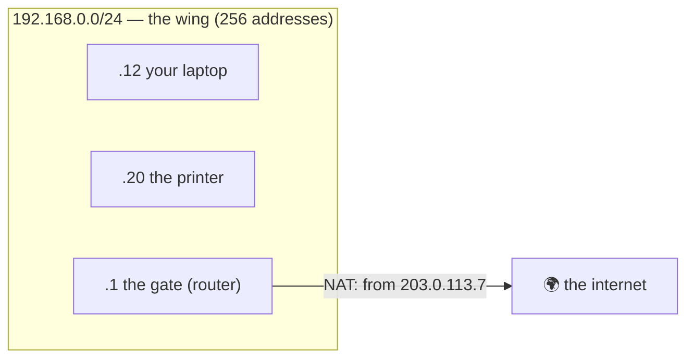

# 🏫 Lesson 02 — IP addresses & subnets: the building's address

**📍 You are here:** Lesson **02** of 12 · Next: `lesson-03-ports-sockets`

---

## 📦 What's in this branch

Lessons 01–02. The address on the envelope: IPv4, IPv6, subnets, CIDR, private
ranges, and the one public address at the gate.

- [net/demo.py](../../net/demo.py) — the `route` section prints the address this machine uses to reach the internet

## 🧒 Explain like I'm 5

Every building on the road has a street address — four numbers with dots, like
`192.168.0.12`. Buildings on the same **wing** of the campus share the start of
their address (`192.168.0.`) and can pass notes directly; a note to another
wing goes to the **corridor door** (the gateway) first. Some addresses are
**private**: every school on earth uses the same ones inside, and the **gate**
swaps them for the school's one **public** address when a note leaves.

## 🗺️ Diagram



## ❓ What

- **IPv4**: 32 bits written as four numbers 0–255. About four billion; scarce.
- **IPv6**: 128 bits, hex groups (`2001:db8::12`); plenty; no NAT needed.
- **Subnet / CIDR**: `192.168.0.0/24` means "the first 24 bits are the wing";
  the remaining 8 bits give 256 addresses (.0 network, .255 broadcast, 254 usable).
- **Private ranges**: `10/8`, `172.16/12`, `192.168/16` — never routed on the
  internet; reused everywhere; hidden behind NAT.
- **Loopback**: `127.0.0.1` / `::1` — "this building". **Gateway**: the door out of the wing.

## 🤔 Why

Subnets decide who talks directly and who goes through a router; security
groups and firewalls are written in CIDR; every cloud VPC is a campus of
subnets you draw. Reading `/24` fluently is table stakes.

## 🔧 How (in this repo)

The `route` section opens a UDP socket "towards" 8.8.8.8 without sending —
the OS picks the outward address, which is how you learn which wing you are in
from code.

## 🧪 Try it

```bash
python3 net/demo.py route
ip addr | grep inet 2>/dev/null || ifconfig | grep inet     # your addresses; note the /24 or netmask
ip route 2>/dev/null || netstat -rn | head -5               # the default gateway: the door out of the wing
python3 -c "import ipaddress as i; n=i.ip_network('192.168.0.0/24'); print(n.num_addresses, list(n.hosts())[:3], n.broadcast_address)"
```

## ✅ Verify — what you should see

Your outward address is private (`192.168.…`, `10.…` or `172.16–31.…`); the
gateway is usually `.1` of your wing; the Python one-liner prints `256`, three
host addresses and `192.168.0.255`.

## 🏁 What you just proved

You can read an address and its mask, find your gateway, and explain why the
address on your laptop is not the address the internet sees.

## ⚠️ Common mistakes

- `/24` read as "24 addresses". It is 24 *network* bits → 256 addresses.
- Opening a database to `0.0.0.0/0` "for now". That is every building on earth.
- Assuming two machines with the same private address are the same machine.

> 🏭 **Why this matters in production:** a VPC with overlapping CIDRs cannot
> peer; a security group written as `/32` is one machine, `/0` is everyone.
> The AWS school's campus is this lesson with a bill.

## ⏭️ Next

**Lesson 03 — ports & sockets:** the room number, and why a server listens on
one room while every visitor gets their own desk.
