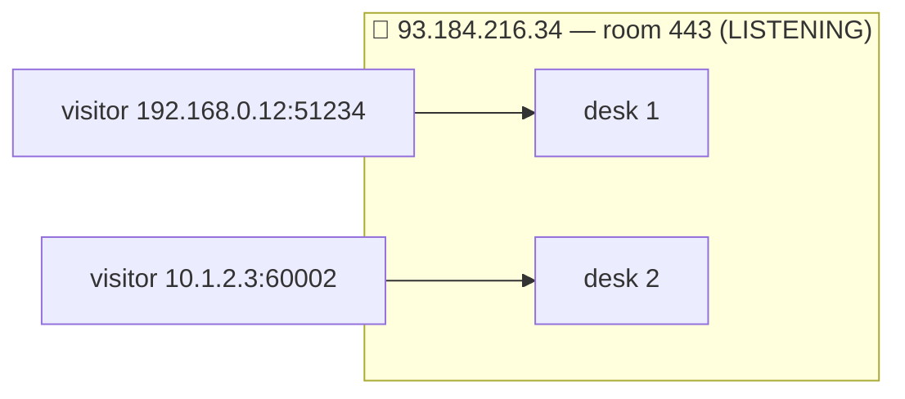

# 🚪 Lesson 03 — Ports & sockets: room numbers and desks

**📍 You are here:** Lesson **03** of 12 · Next: `lesson-04-layers`

---

## 📦 What's in this branch

Lessons 01–03. The room number on the envelope, and the desk where a
conversation actually happens.

- [net/demo.py](../../net/demo.py) — the `ports` section knocks on the usual doors; the `tcp` section shows both desks of one connection

## 🧒 Explain like I'm 5

One building, many rooms. The address gets the envelope to the building; the
**room number** gets it to the right person: room 80 is the web office, 443 the
sealed web office, 22 the caretaker's door, 5432 the record room. A **server**
sits in its room with the door open, **listening**. Each visitor who comes in
gets their own **desk** — a socket — so the clerk can serve many at once.

## 🗺️ Diagram



## ❓ What

- A **port** is a 16-bit number, 0–65535. **Well-known** rooms are 0–1023
  (need root to open); 1024–49151 registered; the rest **ephemeral**, handed
  to clients at random.
- A **socket** is one endpoint; a **connection** is the 4-tuple
  `(local ip, local port, remote ip, remote port)`. The server's port stays the
  same for everyone; the client's port makes each conversation unique.
- `LISTEN` vs `ESTABLISHED`: one listening socket accepts; each accepted
  connection is a new socket.

## 🤔 Why

"Address already in use", "connection refused", "which process has port 8080",
"the app listens on localhost but the container can't see it" — all room
questions. Firewalls (lesson 10) are lists of rooms; load balancers
(lesson 11) are desks in front of rooms.

## 🔧 How (in this repo)

`ports()` calls `connect_ex` on each well-known port with a 200 ms timeout:
`0` means someone answered the knock. `tcp()` prints `getsockname()` and
`getpeername()` — the two ends of one connection.

## 🧪 Try it

```bash
python3 net/demo.py ports
python3 -m http.server 8080 &           # open room 8080
python3 net/demo.py ports | grep 8080   # now it says open
ss -ltnp 2>/dev/null || lsof -nP -iTCP -sTCP:LISTEN   # who is listening where
kill %1
```

## ✅ Verify — what you should see

`8080 … closed` before, `open ← someone is listening` after; `ss`/`lsof` names
`python` on `*:8080`. Bind to `127.0.0.1` and other machines cannot reach it;
bind to `0.0.0.0` and they can — that is the container mistake in one line.

## 🏁 What you just proved

A port is a room, a socket is a desk, and you can tell which rooms are open on
any machine you can reach.

## ⚠️ Common mistakes

- Listening on `127.0.0.1` inside a container and wondering why the host cannot connect.
- Two services configured for the same port: the second one dies with "address in use".
- Thinking a closed port and a firewalled port look the same (they do not — lesson 10).

> 🏭 **Why this matters in production:** the app listens on 8080, the health
> check probes 8081, the sidecar takes 15020, the debugger 5005 — every
> incident report names a room. `ss -ltnp` is the first command on any box.

## ⏭️ Next

**Lesson 04 — the layers:** the delivery chain from letter to road, and why
each layer only knows its neighbours.
