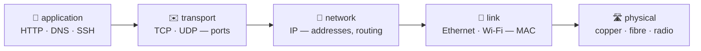

# 📦 Lesson 04 — The layers: the delivery chain

**📍 You are here:** Lesson **04** of 12 · Next: `lesson-05-tcp-udp`

---

## 📦 What's in this branch

Lessons 01–04. Letter, envelope, bag, van, road — the layers of the internet,
and what "L4" and "L7" mean when people say them.

- [net/demo.py](../../net/demo.py) — the `http` section writes a letter (HTTP) straight into an envelope (TCP) so you can see the two layers touch

## 🧒 Explain like I'm 5

Nobody carries a bare letter across town. The letter goes in an **envelope**
with the room number, the envelope in a **bag** with the building's address,
the bag in a **van** that only knows the next stop, and the van on a **road**.
At the other end each wrapper comes off in turn, and each helper reads only
their own label: the driver never opens a bag, the postroom never reads a
letter. That is encapsulation, and it is why you can change the road (Wi-Fi to
5G) without the letter noticing.

## 🗺️ Diagram



## ❓ What

| Layer (TCP/IP) | OSI | The wrapper | Header carries | Tools |
|---|---|---|---|---|
| application (L7) | 7 | the letter | HTTP method, path, headers | curl, dig |
| transport (L4) | 4 | the envelope | ports, sequence numbers | ss, nc |
| network (L3) | 3 | the bag | IP addresses, TTL | ping, traceroute, ip |
| link (L2) | 2 | the van | MAC addresses | arp, ip link |
| physical (L1) | 1 | the road | volts, light, radio | the cable |

- **Encapsulation**: each layer prepends its header. A packet on the wire is
  headers inside headers inside a frame.
- **L4 / L7** are the words load balancers and firewalls use: L4 sees ports,
  L7 sees the request.

## 🤔 Why

Layers are why the internet could grow: HTTP was designed once and rides
every road invented since. They are also why debugging works bottom-up:
if the van cannot leave (no link), no letter matters.

## 🔧 How (in this repo)

`http()` opens a TCP socket (L4) and writes the L7 text by hand; the OS adds
IP and Ethernet below. Run it with `tcpdump` in another terminal and you see
every layer of the same packet.

## 🧪 Try it

```bash
python3 net/demo.py http
sudo tcpdump -ni any 'tcp port 80' -c 6 2>/dev/null &      # optional: the envelopes on the wire
python3 net/demo.py http                                    # watch SYN, SYN-ACK, ACK, then PSH with your letter
ip link 2>/dev/null || ifconfig | grep -i ether             # the van's own label: the MAC address
```

## ✅ Verify — what you should see

`http` prints your request line, the `200 OK` status line and the body size.
tcpdump (if you ran it) shows the three-way handshake before the first byte
of HTTP — the envelope exists before the letter.

## 🏁 What you just proved

HTTP is text riding on TCP riding on IP riding on your Wi-Fi — and you can
name which tool looks at which layer.

## ⚠️ Common mistakes

- Debugging L7 (the app) when L3 is broken (no route). Start at the bottom.
- Saying "the OSI model has 7 layers" as if the internet used all seven distinctly. Learn the 5 that matter.
- Forgetting MTU: a bag bigger than ~1500 bytes gets fragmented or dropped.

> 🏭 **Why this matters in production:** "L4 load balancer", "L7 policy",
> "L2 adjacency", "MTU mismatch on the VPN" — every one of these is a sentence
> about which wrapper a device reads.

## ⏭️ Next

**Lesson 05 — TCP vs UDP:** the two envelopes, and what a handshake buys you.
