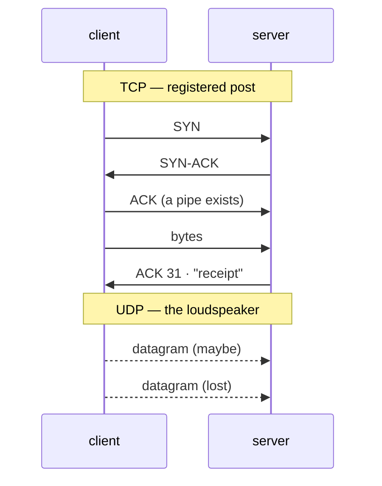

# 📬 Lesson 05 — TCP vs UDP: registered post vs the loudspeaker

**📍 You are here:** Lesson **05** of 12 · Next: `lesson-06-dns`

---

## 📦 What's in this branch

Lessons 01–05. The two transport contracts, seen on real sockets.

- [net/demo.py](../../net/demo.py) — `tcp`: a handshake, three pieces, one receipt; `udp`: ten shouts, some lost

## 🧒 Explain like I'm 5

**Registered post** (TCP): before the first letter, both offices agree to
talk — "ready?" "ready!" "go" — and after that every letter is numbered,
signed for, re-sent if it goes missing, and handed over in order. Slow to
start, but nothing is lost.

**The loudspeaker** (UDP): you shout the announcement once. No agreement,
no numbers, no receipt. Some people in the corridor miss it. Instant, cheap,
and exactly right when a repeat is better than a delay — a video frame, a
game position, a directory question.

## 🗺️ Diagram



## ❓ What

- **TCP**: connection-oriented, reliable, ordered, flow- and
  congestion-controlled. A **stream**: no message boundaries — the receiver
  sees bytes, so protocols add their own (newline, length prefix, HTTP's blank line).
- **UDP**: connectionless datagrams; may be lost, duplicated, reordered; tiny
  header; the application handles the rest.
- Ports belong to both. `443/tcp` and `443/udp` are different rooms.

## 🤔 Why

Choosing the wrong one costs either correctness or latency. Web, mail,
databases: TCP. DNS, video, voice, games, HTTP/3: UDP with their own smarts.

## 🔧 How (in this repo)

`tcp()` binds a listening socket, accepts in a thread, and the client sends
three pieces with pauses — the clerk reads until a newline because the stream
has no edges. `udp()` drops 30% of sends on purpose and shows what arrived.

## 🧪 Try it

```bash
python3 net/demo.py tcp udp
python3 - <<'EOF'
import socket; s=socket.socket(); s.settimeout(1)
print(s.connect_ex(("127.0.0.1", 9)))     # nothing listens on 9: refused fast (111/61) — a closed room
EOF
```

## ✅ Verify — what you should see

TCP: "sent 3 pieces; the clerk answered: receipt: 31 bytes". UDP: "10 …,
6 heard" (the seed is fixed, so exactly six). The closed room returns a
non-zero code immediately — compare with a firewalled port's silence in
lesson 10.

## 🏁 What you just proved

TCP's guarantees are real and visible; UDP's losses are real and visible; and
message boundaries are yours to add on a TCP stream.

## ⚠️ Common mistakes

- Assuming one `send` = one `recv`. Streams split and merge; frame your messages.
- Using UDP and forgetting that "sometimes" means "in production, daily".
- Blaming the network for a hang that is a missing newline in your own protocol.

> 🏭 **Why this matters in production:** head-of-line blocking, connection
> pools, keep-alive, and the 3-way handshake's round trip are all TCP facts
> that show up as p99 latency. HTTP/3 moved to UDP precisely to fix them.

## ⏭️ Next

**Lesson 06 — DNS:** the directory that turns a name into an address, and why
it opens every outage.
