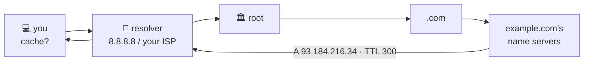

# 📖 Lesson 06 — DNS: the school directory

**📍 You are here:** Lesson **06** of 12 · Next: `lesson-07-http-on-the-wire`

---

## 📦 What's in this branch

Lessons 01–06. The directory: how `example.com` becomes `93.184.216.34`,
with a question built byte by byte.

- [net/demo.py](../../net/demo.py) — `dns`: a 29-byte query to 8.8.8.8 over UDP, and the answer decoded

## 🧒 Explain like I'm 5

Nobody remembers that the science lab is room 216 in building 93.184. You ask
the **directory**: "where is example.com?" The directory on your desk (the
cache) may already know. If not, it asks the school's **resolver**, which asks
the **root** ("who handles .com?"), then **.com** ("who handles example.com?"),
then example.com's own server, which answers with the address and a note:
"remember this for 300 seconds". Next time, nobody asks anyone.

## 🗺️ Diagram



## ❓ What

- **Records**: `A` (IPv4), `AAAA` (IPv6), `CNAME` (alias), `MX` (mail),
  `TXT` (proof, SPF), `NS` (who answers for the zone).
- **TTL**: how long any cache may keep the answer. A change is visible
  everywhere only after the old TTL expires.
- **Resolver** (recursive, asks on your behalf) vs **authoritative** (owns the
  answer). `/etc/hosts` overrides everything locally.
- Transport: UDP port 53; TCP for big answers; DoH/DoT wrap it in HTTPS/TLS.

## 🤔 Why

A wrong or stale directory looks exactly like a dead server. Half of "the
site is down" is DNS: a typo in a record, a TTL nobody waited for, a resolver
that cannot be reached. Hence the first rung of the ladder: **is it DNS?**

## 🔧 How (in this repo)

`dns()` packs a header (id, flags = recursion desired, one question), the
name as length-prefixed labels, type A, class IN — 29 bytes — sends it to
8.8.8.8:53 and parses the answer records, including the compressed-name
pointer. No library; this *is* the protocol.

## 🧪 Try it

```bash
python3 net/demo.py dns
dig +short example.com                 # the same answer, the grown-up tool
dig example.com                        # the full answer: flags, TTL, which server answered
dig +trace example.com | tail -8       # watch root → .com → example.com
dig MX gmail.com +short                # a different record type
```

## ✅ Verify — what you should see

`id matches: True`, one or more `A record → …  ttl 300s` lines, and `dig
+short` printing the same addresses. `dig +trace` shows three hops down the
directory.

## 🏁 What you just proved

You built a DNS question by hand, read the answer, and watched the directory
delegate from the root down.

## ⚠️ Common mistakes

- Changing a record and declaring victory before the old TTL expires.
- A CNAME at the zone apex (`example.com` itself) — not allowed; use an A/ALIAS.
- Forgetting `/etc/hosts` or a corporate resolver is overriding what you expect.

> 🏭 **Why this matters in production:** blue-green cutovers, failover and
> CDNs all move by DNS; the TTL is your rollback time. Route 53 and Cloudflare
> are this lesson with health checks attached.

## ⏭️ Next

**Lesson 07 — HTTP on the wire:** the API school's slip, written by hand onto
the socket, and what HTTP/2 and /3 changed.
