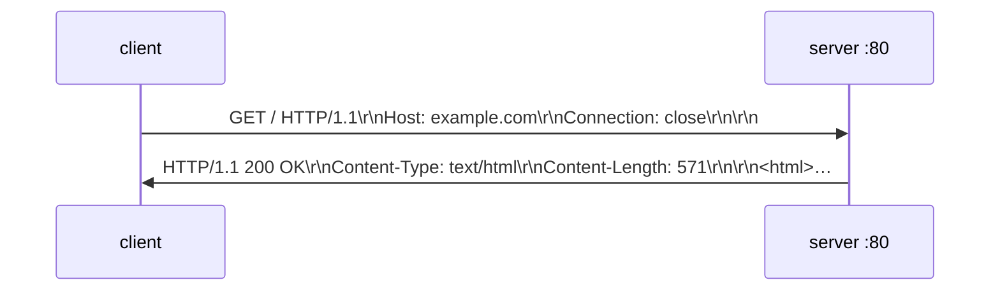

# 📨 Lesson 07 — HTTP on the wire: the slip in the envelope

**📍 You are here:** Lesson **07** of 12 · Next: `lesson-08-tls`

---

## 📦 What's in this branch

Lessons 01–07. The API school's request slip as bytes on a TCP stream, and
what HTTP/1.1, HTTP/2 and HTTP/3 changed about the envelope.

- [net/demo.py](../../net/demo.py) — `http`: a GET typed by hand onto port 80; the status line and headers read back

## 🧒 Explain like I'm 5

The API school taught the **slip**: method, path, headers, body, and the
clerk's **stamp**. This lesson opens the envelope: the slip is just **text
with line breaks**, written into a TCP stream, and the stamp comes back the
same way. HTTP/1.1 keeps the envelope open for the next slip (keep-alive);
HTTP/2 lets many slips travel in one envelope at once; HTTP/3 switches from
registered post to a cleverer loudspeaker (QUIC) so one lost page does not
hold up the others.

## 🗺️ Diagram



## ❓ What

- **Request**: `METHOD path HTTP/1.1`, header lines, a blank line, an
  optional body. **Response**: `HTTP/1.1 status reason`, headers, blank line,
  body. Lines end in `\r\n`. `Host` is required (many sites per address).
- **Keep-alive**: HTTP/1.1 reuses the connection; `Connection: close` ends it.
  `Content-Length` or chunked encoding says where the body stops (the stream
  has no edges — lesson 05).
- **HTTP/2**: binary frames, many streams multiplexed on one TCP connection,
  header compression. **HTTP/3**: the same over QUIC (UDP), no head-of-line
  blocking, faster handshake with TLS built in.

## 🤔 Why

Reading raw HTTP is how you debug proxies, CORS, redirects, caching headers
and "it works with curl but not in the browser". `curl -v` shows exactly
these lines; now you can read them.

## 🔧 How (in this repo)

`http()` writes the four lines by hand, reads until the server closes, splits
on the first blank line, and prints the status line plus three headers. That
is a complete HTTP client in twelve lines — every framework is this plus
edge cases.

## 🧪 Try it

```bash
python3 net/demo.py http
printf 'GET / HTTP/1.1\r\nHost: example.com\r\nConnection: close\r\n\r\n' | nc example.com 80 | head -12   # by hand, no Python
curl -sv http://example.com -o /dev/null 2>&1 | grep -E '^(>|<)'       # the same lines, from the grown-up tool
curl -sI --http2 https://example.com | head -3                          # HTTP/2 when TLS is on
```

## ✅ Verify — what you should see

`HTTP/1.1 200 OK`, a `Content-Type: text/html` header, `body: 571 bytes`
(or thereabouts). `nc` shows identical lines. `curl --http2` reports
`HTTP/2 200`.

## 🏁 What you just proved

HTTP is text on a stream, you can speak it without a library, and the
versions differ in the envelope, not the slip.

## ⚠️ Common mistakes

- Forgetting the `Host` header: many servers answer 400 or the wrong site.
- Forgetting the blank line: the server waits forever for the end of your headers.
- Assuming HTTP/2 needs new code: the API school's counter is untouched; the proxy speaks it.

> 🏭 **Why this matters in production:** a 502 from a proxy, a hung request
> with no `Content-Length`, a CDN ignoring `Cache-Control` — all readable in
> `curl -v` once you know the lines.

## ⏭️ Next

**Lesson 08 — TLS & certificates:** the sealed envelope, and what the padlock
does and does not promise.
