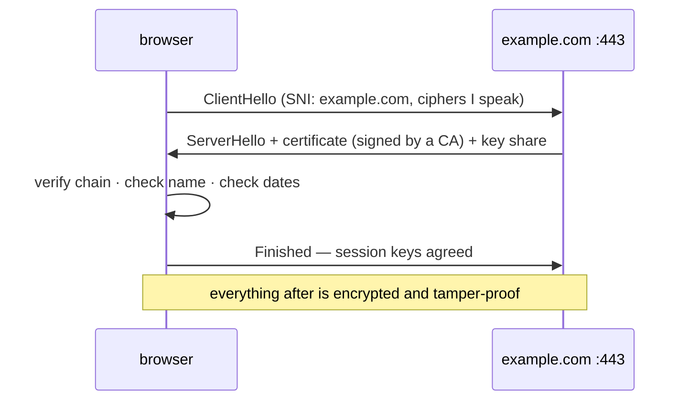

# 🔒 Lesson 08 — TLS & certificates: the sealed envelope

**📍 You are here:** Lesson **08** of 12 · Next: `lesson-09-routing`

---

## 📦 What's in this branch

Lessons 01–08. Certificates, the authority that signs them, the handshake,
and the reading of a real certificate in Python.

- [net/demo.py](../../net/demo.py) — `tls`: a handshake with example.com:443; protocol, cipher, subject, issuer, expiry, alternative names

## 🧒 Explain like I'm 5

A plain envelope can be opened by anyone on the corridor. A **sealed**
envelope cannot — but a seal only helps if you know whose seal it is. So the
server shows an **ID card** (the certificate): "I am example.com", signed by
a **head office** everyone trusts (a certificate authority). Your browser
checks the signature and the name, then the two of you agree a secret way to
seal every envelope from now on. That is TLS; HTTPS is HTTP inside it.

## 🗺️ Diagram



## ❓ What

- A **certificate** binds a public key to names (`CN`, `subjectAltName`),
  with validity dates, signed by a **CA**. Browsers ship a list of trusted CAs.
- The **chain**: leaf → intermediate → root. The server sends the leaf and
  intermediates; the root is already on your machine.
- **SNI**: the client says which name it wants in the first message, so one
  address can host many certificates.
- **TLS 1.3**: one round trip, only strong ciphers, forward secrecy. Older
  versions exist to be turned off.
- What TLS proves: you are talking to the holder of that name's key, and
  nobody in between can read or alter. What it does not prove: that the site
  is honest, or that the content is safe.

## 🤔 Why

Expired certificates are a top-three cause of outages nobody planned. Wrong
names, missing intermediates and self-signed certificates in production are
the others. Reading a certificate takes ten seconds once you have done it.

## 🔧 How (in this repo)

`tls()` wraps a TCP socket with `ssl.create_default_context()` (which loads
the trusted CAs and verifies the name), then prints `version()`, `cipher()`,
and fields from `getpeercert()`.

## 🧪 Try it

```bash
python3 net/demo.py tls
echo | openssl s_client -connect example.com:443 -servername example.com 2>/dev/null | grep -E 'subject=|issuer=|Verify'
echo | openssl s_client -connect example.com:443 -servername example.com 2>/dev/null | openssl x509 -noout -dates
curl -sv https://expired.badssl.com 2>&1 | grep -iE 'expired|SSL certificate' | head -2     # what a broken seal looks like
```

## ✅ Verify — what you should see

`protocol TLSv1.3` (or 1.2), an issuer organisation, a `valid until` date in
the future, and `also valid for: ['example.com', '*.example.com']`. The
badssl check fails with an expiry error — on purpose.

## 🏁 What you just proved

You can read who vouches for a site and until when — and recognise the
three ways a seal breaks.

## ⚠️ Common mistakes

- Turning off verification (`verify=False`, `-k`) to "make it work". You made it insecure.
- Forgetting the intermediate certificate: works in one browser, fails in another.
- A 90-day Let's Encrypt certificate with no automation. Day 91 is an outage.

> 🏭 **Why this matters in production:** certificate expiry monitoring, SNI
> on load balancers, mTLS between services (API school lesson 14) and TLS
> termination at the reception desk (lesson 11) are this handshake at scale.

## ⏭️ Next

**Lesson 09 — routing & the internet:** how a bag finds a building nobody has
a full map to.
