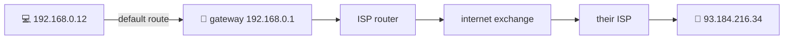

# 🧭 Lesson 09 — Routing & the internet: the corridor map

**📍 You are here:** Lesson **09** of 12 · Next: `lesson-10-firewalls-nat-vpn`

---

## 📦 What's in this branch

Lessons 01–09. How packets get from your wing to a server eight hops away
when nobody holds the whole map.

- [net/demo.py](../../net/demo.py) — `route`: the address you leave by; then `traceroute` shows every corridor

## 🧒 Explain like I'm 5

No porter knows the way to every room on earth. Each one knows a rule: "bags
for *this* wing go to *that* door; everything else, down the corridor to the
next porter." Your laptop hands everything foreign to the **gateway**; the
gateway to the ISP; the ISP looks at the address's **prefix** and passes it
on; eight porters later the bag arrives. The porters keep their rules current
by telling each other which prefixes they can reach — that gossip is **BGP**.

## 🗺️ Diagram



## ❓ What

- A **route** is `prefix → next hop (via interface)`. The most specific
  prefix wins; `0.0.0.0/0` is the default route.
- **TTL** (time to live): each router decrements it; at 0 the packet is
  dropped and an ICMP "time exceeded" comes back — that is how **traceroute**
  reveals every hop.
- **MTU**: the largest bag a link carries (~1500 bytes on Ethernet); bigger
  packets fragment or, if fragmentation is forbidden, are dropped — the
  classic "small requests work, big ones hang".
- **BGP**: how ~75,000 autonomous systems announce prefixes to each other.
  One bad announcement can black-hole a country.

## 🤔 Why

"Reachable from the office but not from the cloud", "asymmetric routes",
"the VPN drops large uploads" — routing problems look like everything else
until you traceroute.

## 🔧 How (in this repo)

`route()` lets the OS pick the interface for 8.8.8.8 and prints that address.
The rest of the lesson is the tools already on your machine.

## 🧪 Try it

```bash
python3 net/demo.py route
ip route 2>/dev/null || netstat -rn | head -6        # your rules: the default route and your wing
traceroute -m 12 example.com 2>/dev/null || tracepath example.com   # every porter on the way
ping -c 3 -s 1472 example.com                        # a full-size bag; try -s 1473 with -M do (Linux) to see MTU refuse
```

## ✅ Verify — what you should see

A `default via 192.168.0.1` line, a `192.168.0.0/24` line for your wing, and
a traceroute with ~6–12 hops ending at example.com's address. Some hops show
`* * *` — routers that do not answer, which is normal.

## 🏁 What you just proved

You can read your machine's route table and see the corridors between you and
any server — and you know why some porters stay silent.

## ⚠️ Common mistakes

- Two VPCs (or a VPN and the office) with overlapping prefixes: packets go to the wrong wing.
- Reading `* * *` as "broken". It is "quiet".
- Ignoring MTU on tunnels and VPNs; it shows up as hangs on large transfers only.

> 🏭 **Why this matters in production:** route tables in every VPC, peering,
> transit gateways, and the BGP incident that takes a provider offline are
> this lesson. Kubernetes pods get a prefix per node for the same reason.

## ⏭️ Next

**Lesson 10 — firewalls, NAT & VPNs:** the gate, and the difference between
"refused" and "timed out".
