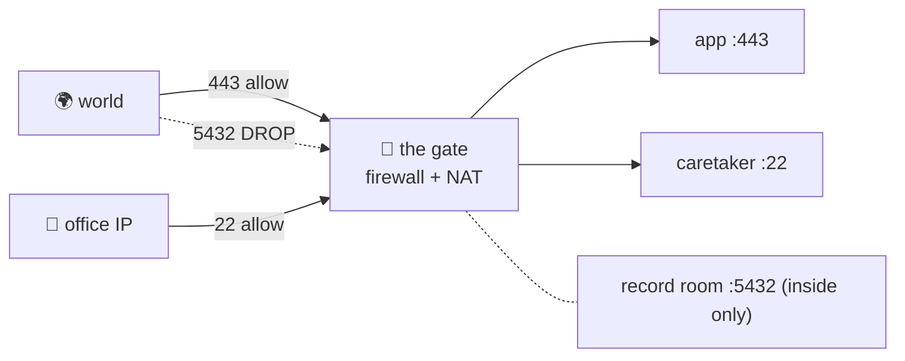

# 🚧 Lesson 10 — Firewalls, NAT & VPNs: the gate

**📍 You are here:** Lesson **10** of 12 · Next: `lesson-11-load-balancers-cdn`

---

## 📦 What's in this branch

Lessons 01–10. Who may knock on which room: the firewall, the address
translation at the gate, and tunnels through it.

- [net/demo.py](../../net/demo.py) — `ports` (a closed room refuses fast) and `route` (your private address behind NAT)

## 🧒 Explain like I'm 5

The **gate** has a list: visitors may knock on room 443, staff from the
office may use the caretaker's door 22, nobody may enter the record room from
outside. Envelopes that break the rule are not refused — they are silently
dropped, so the sender waits and waits. The gate also does **NAT**: inside,
everyone has a private address; leaving, every envelope is re-labelled with
the school's one public address and the gate remembers who asked so the
reply finds its way back. A **VPN** is a tunnel through the gate: from home,
you are "inside".

## 🗺️ Diagram



## ❓ What

- **Firewall**: rules on (source, destination, port, protocol) → allow /
  deny. **Stateful**: replies to connections you opened are allowed back.
  Cloud **security groups** are stateful allow-lists per instance, deny by
  default.
- **NAT**: rewrites private source addresses to a public one and keeps a
  port-mapping table. Inbound needs an explicit **port forward**.
- **Refused vs timed out**: a closed port sends a reset immediately; a
  firewall drops silently and you time out. The error names the culprit.
- **Tunnels**: `ssh -L local:host:port` carries one room through the gate;
  a **VPN** carries your whole machine.

## 🤔 Why

Most "cannot connect" incidents after a deploy are a rule that was not added,
or one added to the wrong wing. Least privilege — 443 to everyone, 22 to
you, the database to the app's subnet only — is a five-line policy that
prevents most breaches.

## 🔧 How (in this repo)

`connect_ex` in `ports()` returns immediately for closed rooms; set the
timeout to 3 s and try a firewalled host to feel the difference.

## 🧪 Try it

```bash
python3 net/demo.py ports                               # closed rooms answer fast
nc -zv -w 3 example.com 8443 ; echo "exit $?"           # a port the gate drops: ~3 s, then timed out
nc -zv -w 3 example.com 443                             # the allowed room: succeeded
ssh -L 15432:db.internal:5432 bastion.example -N &      # (if you have one) a tunnel: localhost:15432 is now the record room
```

## ✅ Verify — what you should see

Closed local ports: `closed` instantly. `8443` on example.com: a three-second
wait then a timeout — the gate. `443`: `succeeded!`. Refused is fast, dropped
is slow: that is the whole diagnostic.

## 🏁 What you just proved

You can tell an empty room from a locked gate by the shape of the failure, and
explain why your laptop's address never appears on the internet.

## ⚠️ Common mistakes

- `0.0.0.0/0` on port 22 or 5432 "temporarily". Bots find it in minutes.
- Debugging the app for an hour when the security group was never updated.
- Believing "inside the VPN" means trusted. A stolen laptop is inside too (see the trade-offs page).

> 🏭 **Why this matters in production:** security groups, NACLs, WAFs and
> zero-trust proxies are this gate at different layers; every cloud outage
> post-mortem with "misconfigured rule" is this lesson.

## ⏭️ Next

**Lesson 11 — load balancers, proxies & CDNs:** the reception desk in front of
many rooms, and the copy near the reader.
