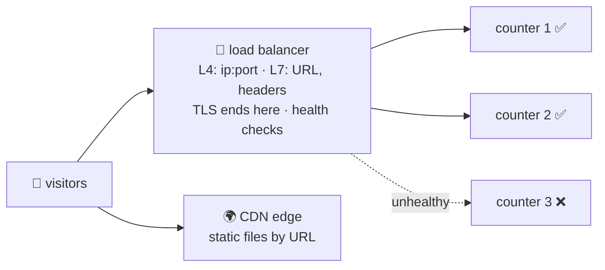

# 🏪 Lesson 11 — Load balancers, proxies & CDNs: the reception desk

**📍 You are here:** Lesson **11** of 12 · Next: `lesson-12-debugging`

---

## 📦 What's in this branch

Lessons 01–11. One name, many counters: the desk that spreads visitors,
checks health and ends the sealed envelope — and the copy of the notice board
in every city.

- [net/demo.py](../../net/demo.py) — `http` and `tls`: the two things a reception desk speaks on your behalf

## 🧒 Explain like I'm 5

A thousand visitors ask for "the office". They cannot all go to one desk. So
a **reception desk** stands in front: it sends each visitor to a free
counter, skips a counter that is off sick (health check), and can read the
sealed envelope itself so the counters do not have to. A **reverse proxy** is
the same desk with extra manners: it may rewrite the slip, cache the answer,
or add a note saying where the visitor really came from. A **CDN** is a
reception desk in every city with a copy of the notice board — the reader
gets the copy nearest them.

## 🗺️ Diagram



## ❓ What

- **L4** balancing: by address and port, protocol-agnostic, TLS passes
  through. **L7**: by URL, header, cookie; terminates TLS; can retry, rewrite,
  route a canary.
- **Algorithms**: round-robin, least connections, hashing; **sticky sessions**
  pin a visitor to one counter (a cookie).
- **Health checks** remove a bad counter before visitors notice.
  `X-Forwarded-For` / `Forwarded` carry the real client address through.
- **CDN**: caches responses by URL at edges near users; anycast sends you to
  the nearest; static files, images, the UI school's board.
- In Kubernetes: a **Service** is L4, an **Ingress** is L7. In AWS: NLB / ALB.

## 🤔 Why

Scaling horizontally is impossible without a desk in front. Most latency wins
for a global audience come from a CDN, not from faster servers. And most
"the load balancer is broken" is a failing health check.

## 🔧 How (in this repo)

Nothing to run for the desk itself; the two sections you already ran are the
two protocols it speaks. `curl -sI` against any big site shows the desk's
fingerprints: `server: cloudflare`, `via`, `x-cache: HIT`.

## 🧪 Try it

```bash
curl -sI https://www.wikipedia.org | grep -iE 'server|via|x-cache|cf-ray|age'     # the desk's headers
curl -sI https://example.com -H 'X-Forwarded-For: 203.0.113.9' | head -1            # the note the proxy adds (harmless here)
python3 -m http.server 8081 & python3 -m http.server 8082 &                          # two counters; a one-line desk in front:
python3 - <<'EOF'
import http.server, urllib.request, itertools
up = itertools.cycle(["8081", "8082"])
class LB(http.server.BaseHTTPRequestHandler):
    def do_GET(self):
        p = next(up); r = urllib.request.urlopen(f"http://127.0.0.1:{p}{self.path}")
        self.send_response(200); self.send_header("X-Served-By", p); self.end_headers(); self.wfile.write(r.read()[:200])
print("desk on :8000 → 8081, 8082 round-robin"); http.server.HTTPServer(("127.0.0.1", 8000), LB).serve_forever()
EOF
```

## ✅ Verify — what you should see

Wikipedia answers with a `server:` header naming a CDN/proxy and an `age` or
cache header. Your toy desk alternates `X-Served-By: 8081` and `8082` on
repeated `curl -sI localhost:8000`.

## 🏁 What you just proved

A load balancer is an ordinary program that forwards; the value is in health
checks, TLS termination and routing rules — and you can see all three in
headers.

## ⚠️ Common mistakes

- Health-checking `/` (heavy, cached) instead of a cheap `/health` that reflects readiness.
- Sticky sessions as a substitute for stateless counters.
- Caching an API response with a `Set-Cookie` in it at the CDN. One user's data for everyone.

> 🏭 **Why this matters in production:** ALB vs NLB, Ingress controllers,
> Cloudflare in front of everything — the desk is where TLS, WAF, rate limits
> and canaries live. The API school's gateway (lesson 12) is this desk with
> auth attached.

## ⏭️ Next

**Lesson 12 — debugging the network:** the six-rung ladder and the toolbox.
