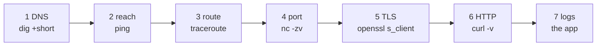

# 🔧 Lesson 12 — Debugging the network: the triage ladder

**📍 You are here:** Lesson **12** of 12 · 🎓 The last one

---

## 📦 What's in this branch

Lessons 01–12 — the whole course. The ladder that turns "it's down" into a
named cause, and the toolbox on each rung.

- [net/lab.sh](../../net/lab.sh) — the ladder as one script: dig → ping → traceroute → nc → openssl → curl → who is listening
- [net/demo.py](../../net/demo.py) — every section is one rung, in Python

## 🧒 Explain like I'm 5

When a letter does not arrive, you do not shout at the building. You climb a
ladder: Is the name in the **directory**? Can I **reach** the building at
all? Which **corridor** goes wrong? Is the **room** open? Is the **seal**
valid? Is the **letter** itself well-formed? Only then: what did the clerk
write in the **log**? Each rung has one tool, and the first rung that fails
names the cause.

## 🗺️ Diagram



## ❓ What

| Rung | Question | Tool | The error that names it |
|---|---|---|---|
| 1 | is it DNS? | `dig +short`, `nslookup` | NXDOMAIN, stale address |
| 2 | can I reach it? | `ping`, `mtr` | 100% loss (or ping blocked — check rung 4 anyway) |
| 3 | which corridor? | `traceroute`, `tracepath` | hops stop at one router |
| 4 | is the room open? | `nc -zv`, `ss -ltnp` | refused (empty) vs timed out (gate) |
| 5 | is the seal valid? | `openssl s_client`, `curl -v` | expired, wrong name, unknown CA |
| 6 | is the letter right? | `curl -v`, `tcpdump` | 4xx your slip, 5xx their office, hang = no length |
| 7 | what happened inside? | the app's logs, request id | everything else |

- **Latency vs bandwidth**: `ping` measures latency (ms, distance, hops);
  a download measures bandwidth (Mbit/s). A slow site far away is latency;
  a slow big file is bandwidth.
- **tcpdump / Wireshark**: read the envelopes themselves when nothing else
  explains it.

## 🤔 Why

Order matters: a DNS mistake will fail every later rung and waste an hour of
TLS debugging. The ladder is the fastest path from symptom to cause, and it is
the same on a laptop, a VM and a pod.

## 🔧 How (in this repo)

`net/lab.sh HOST` runs rungs 1–6 with the standard tools and prints the
triage order at the end; each falls back when a tool is missing.

## 🧪 Try it

```bash
bash net/lab.sh example.com
bash net/lab.sh nonexistent.example        # rung 1 fails: NXDOMAIN — stop there
bash net/lab.sh 203.0.113.1                # a documentation address: rung 2 fails — unreachable
bash net/lab.sh expired.badssl.com         # rungs 1–4 pass, rung 5 fails — the seal
sudo tcpdump -ni any 'port 53' -c 4 &  dig +short example.com    # optional: the directory question on the wire
```

## ✅ Verify — what you should see

Against example.com every rung passes and `curl` prints `HTTP/2 200`.
Against each broken host exactly one rung fails first, and its message names
the cause: NXDOMAIN, unreachable, certificate expired.

## 🏁 What you just proved

You can take any "it's down" and, in under two minutes, say which of seven
things is wrong — with the command that proved it.

## ⚠️ Common mistakes

- Starting at rung 6 (`curl -v`) and reading a TLS error as an app bug.
- Treating a blocked `ping` as "unreachable"; many hosts drop ICMP — go to rung 4.
- Restarting things before running the ladder. You lose the evidence.

> 🏭 **Why this matters in production:** this ladder is the runbook. Put it
> in the on-call doc with your hostnames filled in; the first responder
> should never have to remember it at 3 a.m.

## 🏆 Capstone

Write a one-page runbook for a service you use: its name, address, port,
certificate expiry, the load balancer in front, and the seven rungs with the
exact command for each. Then break one rung on purpose (a wrong `/etc/hosts`
entry, a closed port) and prove the runbook finds it.

## 🎓 The course is complete

The [study plan](https://baluraut.github.io/learn-networking-school/study-plan.html)
ticks the twelve off; the [quiz](https://baluraut.github.io/learn-networking-school/quiz.html)
checks them; the [AWS school](https://baluraut.github.io/learn-aws-school/) rents this
building by the hour, and the [School portal](https://baluraut.github.io/school/) has
the certificate.
